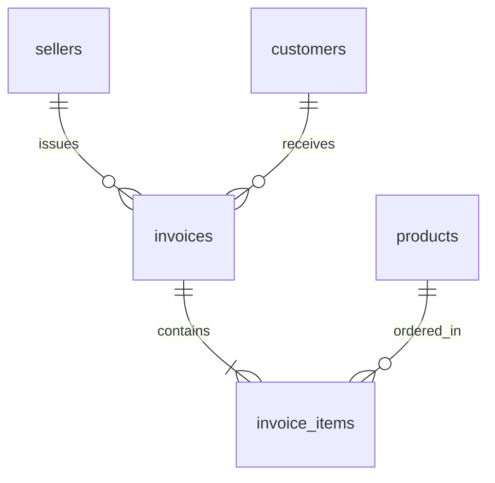

# 📑 Invoice-to-Schema Reverse Engineering Engine

An AI-driven database architecture tool that reverse-engineers a 3rd Normal Form (3NF) relational database schema directly from unstructured flat invoice documents.

---

## 🚀 Key Features
- **Pydantic Data Contracts:** Enforces strict structural boundaries and schema data types.

- **Relational Schema Inference:** Decomposes flat repeating entities into normalized parent-child relational tables.

- **Automated SQL DDL:** Generates production-ready `CREATE TABLE` scripts with Foreign Key constraints.

- **Visual ERD Support:** Outputs native Mermaid.js Entity-Relationship diagram syntax.

---

## 🛠️ Tech Stack
- Python 3.10+
- Google Gemini API (`gemini-3.5-flash`)
- Pydantic v2
- SQLite

---

## 📊 Inferred Architecture (ER Diagram)



---

## ⚙️ How to Run

1. **Clone the Repository:**
```
https://github.com/satyanarayana51115/schema-reverse-engine
```
2. **Install dependencies:**
```
pip install -r requirements.txt
```
3. **Configure your API key in a .env file:**
```
GEMINI_API_KEY="your_api_key_here"
```
4. **Run the engine:**
```
python main.py
```
5. **Output files schema.sql and diagram.mmd will 
be generated in the root directory**
```

```
